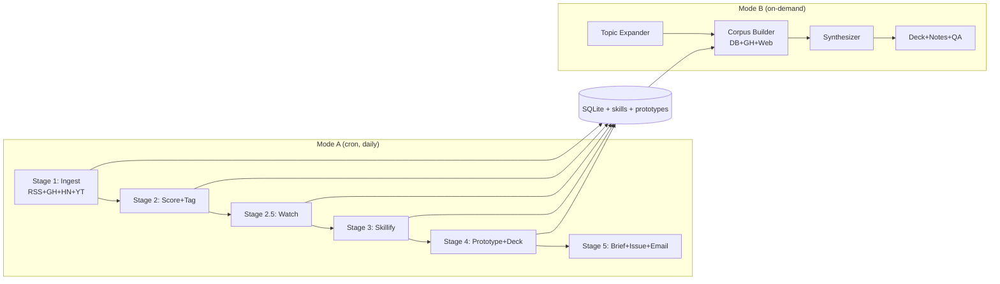

# TrendForge

Local autonomous agent that ingests AI/LLM news daily, distills it,
generates Claude skills, builds runnable prototypes, opens a GitHub
issue with the morning digest, and emails a one-line-per-item firehose
to **anirudh.royyuru@gmail.com**.

## Modes

- **Mode A — Cron-driven daily digest.** Runs at 7am local time. Pulls
  the last 24 hours of activity from RSS feeds, GitHub trending, Hacker
  News, awesome-list deltas, and YouTube. Scores against
  `config/interests.yaml`, picks the top 3, watches associated videos
  with Brad's `/watch` skill, generates a Claude skill per item, builds
  a runnable prototype, generates a 5-slide deck, opens a GitHub issue,
  emails a digest.
- **Mode B — On-demand research.** `python -m trendforge.research --topic
  "agent memory" --duration 30 --depth deep`. Uses the accumulated DB +
  live GitHub + web search to produce a dossier, slides, speaker notes,
  Q&A prep, and a working demo.

## Architecture



## Install

```bash
git clone <this-repo> trendforge
cd trendforge
bash scripts/install.sh
# fill in .env with GITHUB_TOKEN, GMAIL_SENDER, GMAIL_APP_PASSWORD
```

`/watch` skill (recommended for Mode A):

```bash
git clone https://github.com/bradautomates/claude-video.git ~/.claude/skills/watch
sudo apt install -y ffmpeg && pip install yt-dlp   # macOS: brew install ffmpeg yt-dlp
mkdir -p ~/.config/watch && echo "GROQ_API_KEY=..." > ~/.config/watch/.env
```

If `/watch` isn't installed, the pipeline falls back to a YouTube
page-title scrape and keeps moving.

## Run

```bash
# One-shot, no Claude CLI required (handy for first verification)
python -m trendforge.orchestrator --skip-video --skip-skill --dry-run

# Full Mode A run (writes brief, opens GitHub issue, sends email)
python -m trendforge.orchestrator
```

Cron (`crontab -e`):

```
0 7 * * * /home/anirudh/trendforge/scripts/cron_runner.sh
```

## Backlog + Knowledge Graph

Hand-pinned items survive across runs and get auto-published in two places:

- `output/backlog.md` — markdown view, tracked in git
- A persistent GitHub issue labelled `backlog` (auto-upserted every run)

Pin items by editing `scripts/seed_backlog.py` (or by setting `pinned = 1`
+ filling `notes` and `business_pitch` directly on the items row), then run:

```bash
PYTHONPATH=. python3 scripts/seed_backlog.py
PYTHONPATH=. python3 -m trendforge.backlog        # regenerate md + GH issue
```

Graphify produces a knowledge-graph view of the whole DB — items, tags,
skills, prototypes, and Adroitec projects (PitchBot / ARIA / smart_glasses
/ TrendForge):

- `output/graph.md` — Mermaid diagram (renders natively on GitHub, scoped
  to the backlog so it stays readable)
- `output/graph.json` — full adjacency JSON for Neo4j / Obsidian / vis.js
- `output/graph.html` — interactive vis.js explorer (open in a browser)

Both regenerate on every cron run.

## Mode B — Research

```bash
python -m trendforge.research \
    --topic "agent memory architectures" \
    --audience "JNTU students" \
    --duration 30 \
    --depth deep
```

Outputs land in `output/research/<slug>/`:

- `dossier.md` — full read
- `slides.pptx` — audience-tuned deck
- `speaker_notes.md` — what to say per slide
- `qa_prep.md` — predicted questions + answers
- `demo/` — working code demo
- `sources.json` — every cited item

A Claude Code slash command is provided at `claude/commands/research.md`
— copy it into `~/.claude/commands/` to invoke as `/research <topic>`.

## Layout

| Path | What |
| --- | --- |
| `trendforge/` | Python package |
| `config/sources.yaml` | RSS feeds, GH searches, channels |
| `config/interests.yaml` | bias profile (high-signal keywords + boring filter) |
| `config/watched_repos.yaml` | repos for star-velocity tracking |
| `data/trendforge.db` | local SQLite (gitignored) |
| `output/briefs/` | daily markdown digests (tracked) |
| `output/skills/` | accumulating skill library (tracked) |
| `output/prototypes/` | one folder per concept (tracked) |
| `output/decks/` | .pptx files (gitignored, large) |
| `output/research/` | Mode B dossiers |
| `scripts/cron_runner.sh` | what cron executes |
| `scripts/install.sh` | one-time setup |
| `scripts/backup_db.sh` | nightly DB gzip to `data/archive/` |

## Email recipient

Hard-coded in `trendforge/config_loader.py` as
`DIGEST_RECIPIENT = "anirudh.royyuru@gmail.com"`. SMTP credentials come
from `GMAIL_SENDER` + `GMAIL_APP_PASSWORD` (16-char app password from
[myaccount.google.com/apppasswords](https://myaccount.google.com/apppasswords)).

## Auth

The orchestrator and every Claude subprocess **unsets
`ANTHROPIC_API_KEY`** before invoking `claude`, so the CLI uses your Max
plan login rather than billing the API. Confirm with `claude /status`.

## Troubleshooting

- **No items ingested:** check `GITHUB_TOKEN` is set, run
  `python -m trendforge.stage1_ingest` directly.
- **Skill generation produces stubs:** Claude CLI not in PATH, or
  `ANTHROPIC_API_KEY` is leaking and exhausting your quota. Check
  `which claude` and `env | grep ANTHROPIC`.
- **No email arrived:** check `data/logs/<date>.log` for SMTP errors
  and verify the Gmail app password.

## Tests

```bash
PYTHONPATH=. python3 -m pytest tests/ -q
```
