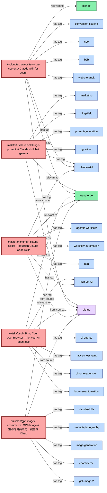

## Knowledge Graph — Backlog View

Auto-generated from `data/trendforge.db`. Re-runs nightly.

```mermaid
graph LR
  classDef item fill:#fde68a,stroke:#92400e,color:#000
  classDef pin fill:#fca5a5,stroke:#7f1d1d,color:#000,stroke-width:3px
  classDef tag fill:#bfdbfe,stroke:#1e3a8a,color:#000
  classDef proj fill:#86efac,stroke:#14532d,color:#000
  classDef src fill:#e9d5ff,stroke:#581c87,color:#000
  classDef skill fill:#fed7aa,stroke:#7c2d12,color:#000
  classDef proto fill:#fcd34d,stroke:#78350f,color:#000

  tag_n8n["n8n"]:::tag
  tag_conversion_scoring["conversion-scoring"]:::tag
  item_243["kycloudtech/website-visual-scorer: A Claude Skill for scorin"]:::pin
  project_pitchbot["pitchbot"]:::proj
  tag_agentic_workflow["agentic-workflow"]:::tag
  tag_image_generation["image-generation"]:::tag
  tag_claude_skills["claude-skills"]:::tag
  tag_workflow_automation["workflow-automation"]:::tag
  tag_higgsfield["higgsfield"]:::tag
  tag_ecommerce["ecommerce"]:::tag
  tag_browser_automation["browser-automation"]:::tag
  source_github["github"]:::src
  tag_prompt_generation["prompt-generation"]:::tag
  tag_claude_skill["claude-skill"]:::tag
  tag_website_audit["website-audit"]:::tag
  item_239["msk3d0ut/claude-skill-ugc-prompt: A Claude skill that genera"]:::pin
  tag_chrome_extension["chrome-extension"]:::tag
  project_trendforge["trendforge"]:::proj
  tag_mcp_server["mcp-server"]:::tag
  tag_ugc_video["ugc-video"]:::tag
  tag_product_photography["product-photography"]:::tag
  item_266["wxtsky/byob: Bring Your Own Browser — let your AI agent use "]:::pin
  tag_b2b["b2b"]:::tag
  tag_seo["seo"]:::tag
  tag_ai_agents["ai-agents"]:::tag
  item_270["masteranime/n8n-claude-skills: Production Claude Code skills"]:::pin
  item_345["buluslan/gpt-image2-ecommerce: GPT-Image-2 驱动的电商素材一键生成 Claud"]:::pin
  tag_gpt_image_2["gpt-image-2"]:::tag
  tag_marketing["marketing"]:::tag
  tag_native_messaging["native-messaging"]:::tag

  item_239 -- "from source" --> source_github
  item_239 -- "has tag" --> tag_claude_skill
  item_239 -- "has tag" --> tag_ugc_video
  item_239 -- "has tag" --> tag_prompt_generation
  item_239 -- "has tag" --> tag_higgsfield
  item_239 -- "has tag" --> tag_marketing
  item_239 -- "relevant to" --> project_trendforge
  item_243 -- "from source" --> source_github
  item_243 -- "has tag" --> tag_claude_skill
  item_243 -- "has tag" --> tag_website_audit
  item_243 -- "has tag" --> tag_b2b
  item_243 -- "has tag" --> tag_seo
  item_243 -- "has tag" --> tag_conversion_scoring
  item_243 -- "relevant to" --> project_pitchbot
  item_243 -- "relevant to" --> project_trendforge
  item_266 -- "from source" --> source_github
  item_266 -- "has tag" --> tag_browser_automation
  item_266 -- "has tag" --> tag_chrome_extension
  item_266 -- "has tag" --> tag_mcp_server
  item_266 -- "has tag" --> tag_native_messaging
  item_266 -- "has tag" --> tag_ai_agents
  item_266 -- "relevant to" --> project_trendforge
  item_270 -- "from source" --> source_github
  item_270 -- "has tag" --> tag_claude_skill
  item_270 -- "has tag" --> tag_n8n
  item_270 -- "has tag" --> tag_workflow_automation
  item_270 -- "has tag" --> tag_mcp_server
  item_270 -- "has tag" --> tag_agentic_workflow
  item_270 -- "relevant to" --> project_trendforge
  item_345 -- "from source" --> source_github
  item_345 -- "has tag" --> tag_gpt_image_2
  item_345 -- "has tag" --> tag_ecommerce
  item_345 -- "has tag" --> tag_image_generation
  item_345 -- "has tag" --> tag_product_photography
  item_345 -- "has tag" --> tag_claude_skills
  item_345 -- "relevant to" --> project_trendforge
```
